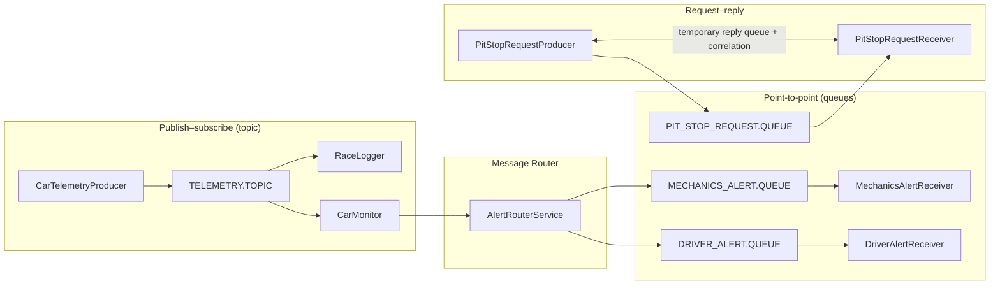

# F1 Team JMS System

Distributed messaging demonstration for a **Formula 1 race support scenario**, implemented with **Spring Boot**, **JMS**, and an **embedded Apache ActiveMQ Artemis** broker. The application fulfills the laboratory goals of combining **publish–subscribe**, **point-to-point queues**, and **request–reply** in one process, with typed JSON payloads (not “everything as `String`”).

---

## Stack

| Item | Version / choice |
|------|------------------|
| Java | **21** |
| Spring Boot | **4.0.6** |
| JSON | **Jackson 3** (`tools.jackson.databind.json.JsonMapper`) |
| JMS message converter | **`JacksonJsonMessageConverter`** (Spring JMS support for Jackson 3) |
| Broker | **Artemis 2.43** embedded (**in-VM**, no separate TCP broker) |
| Build | **Maven Wrapper** (`./mvnw`) |

---

## Architecture overview



1. **Telemetry** — `CarTelemetryProducer` publishes `CarTelemetry` to **`TELEMETRY.TOPIC`** every **10 seconds** (fire-and-forget via `JmsTemplate`).  
2. **Topic subscribers** — `RaceLogger` logs race trace data; `CarMonitor` evaluates thresholds and emits `MechanicsAlert` instances.  
3. **Message Router** — `AlertRouterService` sends every alert to **`MECHANICS_ALERT.QUEUE`** and, if **CRITICAL**, also to **`DRIVER_ALERT.QUEUE`**.  
4. **Queue consumers** — `MechanicsAlertReceiver` and `DriverAlertReceiver` consume their queues.  
5. **Pit stop** — `PitStopRequestProducer` calls **`JmsMessagingTemplate.convertSendAndReceive`** on **`PIT_STOP_REQUEST.QUEUE`** (single thread, synchronous). `PitStopRequestReceiver` replies using **`JMSReplyTo`** and **`JMSCorrelationID`**.

---

## Enterprise Integration Patterns → classes

| Pattern | Role in this project | Main classes |
|--------|----------------------|--------------|
| **Publish–subscribe** | One telemetry publication → **all** topic subscribers receive a copy | `CarTelemetryProducer`, `RaceLogger`, `CarMonitor`; destination `JmsDestinations.TELEMETRY_TOPIC`; **`topicConnectionFactory`** (`pubSubDomain = true`) |
| **Point-to-point** | Each message consumed by **one** listener per queue | `AlertRouterService`, `MechanicsAlertReceiver`, `DriverAlertReceiver`, `PitStopRequestProducer` / `PitStopRequestReceiver`; **`queueConnectionFactory`** (`pubSubDomain = false`) |
| **Message Router** | Route alerts by severity: always mechanics; driver only on **CRITICAL** | **`AlertRouterService`** (`route(MechanicsAlert)`) |
| **Request–reply** | Driver request → team principal decision → correlated reply | **`PitStopRequestProducer`**, **`PitStopRequestReceiver`**; temporary reply queue + correlation header |

---

## JMS configuration highlights

- **No global** `spring.jms.pub-sub-domain=true` — queue vs topic semantics come from **two** explicit `JmsListenerContainerFactory` beans (`JmsConfig`).
- **Destination naming** — constants in **`JmsDestinations`**; names use **`.QUEUE`** / **`.TOPIC`** suffixes for **`DynamicDestinationResolver`**.
- **JSON over TextMessage** — `MessageType.TEXT`, type id property **`_type`** for polymorphic deserialization.

---

## Domain model (typed DTOs)

| Type | Purpose |
|------|---------|
| `CarTelemetry` | Telemetry snapshot (includes `LocalDateTime` with Jackson 3–compatible annotations) |
| `MechanicsAlert` | Threshold breach for pit crew (`AlertSeverity`: `WARNING`, `CRITICAL`) |
| `DriverAlert` | Critical cockpit notification (`requiresPitStop`) |
| `PitStopRequest` / `PitStopResponse` | Pit request and correlated decision |

---

## Prerequisites

- **JDK 21**
- Network on **first** `./mvnw` run (dependency download)

---

## How to run

From the project root (`f1-jms-system`):

```bash
./mvnw clean compile
./mvnw spring-boot:run
```

The embedded broker and listeners start with the application. Default HTTP port (**8080**) may be exposed by `spring-boot-starter-web`; JMS traffic is **in-VM** to Artemis.

---

## What to look for in logs (sanity check)

| Prefix | Meaning |
|--------|---------|
| `[TELEMETRY-PRODUCER]` | Telemetry sent (DEBUG) |
| `[RACE-LOGGER]` | Topic subscriber — full telemetry line |
| `[MESSAGE-ROUTER]` | Alert routed to mechanics / optionally driver |
| `[MECHANICS]` | Mechanics queue consumer |
| `[DRIVER-COCKPIT]` | Driver queue consumer (ERROR level for critical safety) |
| `[DRIVER]` | Pit-stop request / decision (producer side) |
| `[TEAM-PRINCIPAL]` | Pit-stop receiver / random approve–reject |

---

## Scheduling notes

- Telemetry: **10 s** (`CarTelemetryProducer`).
- Pit-stop requests: **15 s** interval, **5 s** initial delay (`PitStopRequestProducer`), **blocking** `convertSendAndReceive` (by design — request–reply on one thread).
- **Thread pool** for `@Scheduled` tasks is configured in **`SchedulerConfig`** so a blocking pit-stop wait does not starve other scheduled jobs.

---

## Academic context

Implements the **graded part** of distributed systems lab **#4 (JMS)** under Spring: telemetry broadcast, **two independent** telemetry consumers, **message routing** to mechanics and conditionally to the driver, and **request–reply** for pit-stop approval — aligned with **Spring Boot 4.x** and **Jackson 3** migration notes from the course materials.

---

## License / course use

University coursework — see module regulations for reuse and attribution.
